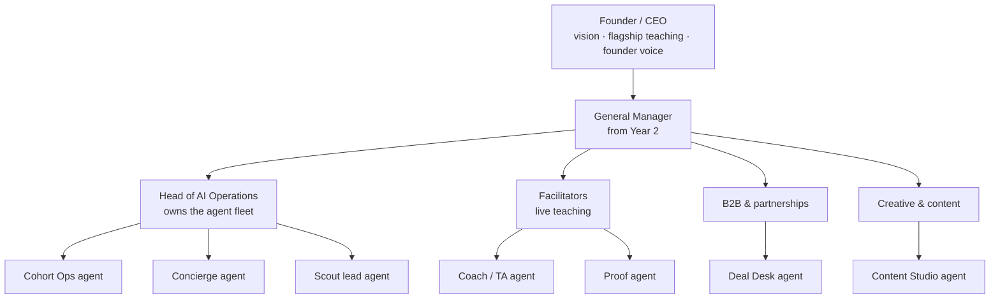

<Info>
**Recommended operating model.** This section replaces the conventional hiring plan in [Organisation & team](/operations/org-and-team) with a leaner design: a small human team that directs a fleet of AI agents. Numbers are planning estimates from the **AI-Native Team** sheet in the [operating model](/financials/three-year-plan).
</Info>

## The rule that shapes everything

> **Agents run the flow. Humans own the moments that build trust.**

WeekendAI Labs sells transformation, and transformation is a human experience. People pay $2,500 for a cohort because a real expert watched their work and told them what to fix. So the plan puts people where trust is built (teaching, selling, hosting, deciding) and gives agents everything that is repeatable, measurable and time-sensitive.

## At a glance

| | Year 1 | Year 2 | Year 3 |
|---|---|---|---|
| Human team (FTE) | **3.5** | **10** | **19** |
| Of which facilitators | 0.5 | 3 | 8 |
| AI agents in production | 6 | 11 | 12 |
| People + agents cost | $445k | $1.16M | $2.02M |
| Baseline team cost (conventional plan) | $430k | $1.31M | $2.33M |
| Revenue per human | ~$517k | ~$622k | ~$768k |
| EBITDA margin (AI-native) | 5.6% | 25.6% | 34.2% |

*Source: operating model, AI-Native Team sheet. Baseline figures from the P&L sheet.*

<Note>
The cost saving is modest in Year 1 and grows to about **$305k a year by Year 3**. That's by design: facilitators, the most expensive human role, stay human. The real gains are fewer coordination roles, faster response times, and revenue per person about **1.5×** the conventional plan.
</Note>

## Three kinds of work

<CardGroup cols={3}>
  <Card title="Human-only" icon="user">
    Live teaching, sales conversations, certification decisions, complaints and refunds, hiring, pricing, and anything published in the founder's voice.
  </Card>
  <Card title="Agent drafts, human approves" icon="user-check">
    Learner feedback, proposals, newsletters, case studies, Transformation Wall entries, curriculum updates.
  </Card>
  <Card title="Agent acts, human monitors" icon="robot">
    Reminders, scheduling, FAQs, lead routing, onboarding, invoicing, dashboards, content repurposing.
  </Card>
</CardGroup>

## How the pieces fit

## Where to go next

<CardGroup cols={2}>
  <Card title="Agent roster" icon="robot" href="/ai-operations/agent-roster">The 12 agents, what they do and who owns each one</Card>
  <Card title="Human touch map" icon="hand-holding-heart" href="/ai-operations/human-touch">Where people must stay in the loop, stage by stage</Card>
  <Card title="Hiring plan & skills" icon="user-plus" href="/ai-operations/hiring-plan">Who to hire, when, and what skills to look for</Card>
  <Card title="Year-by-year rollout" icon="road" href="/ai-operations/year-by-year">How the team and agents grow from Year 1 to Year 3</Card>
</CardGroup>
