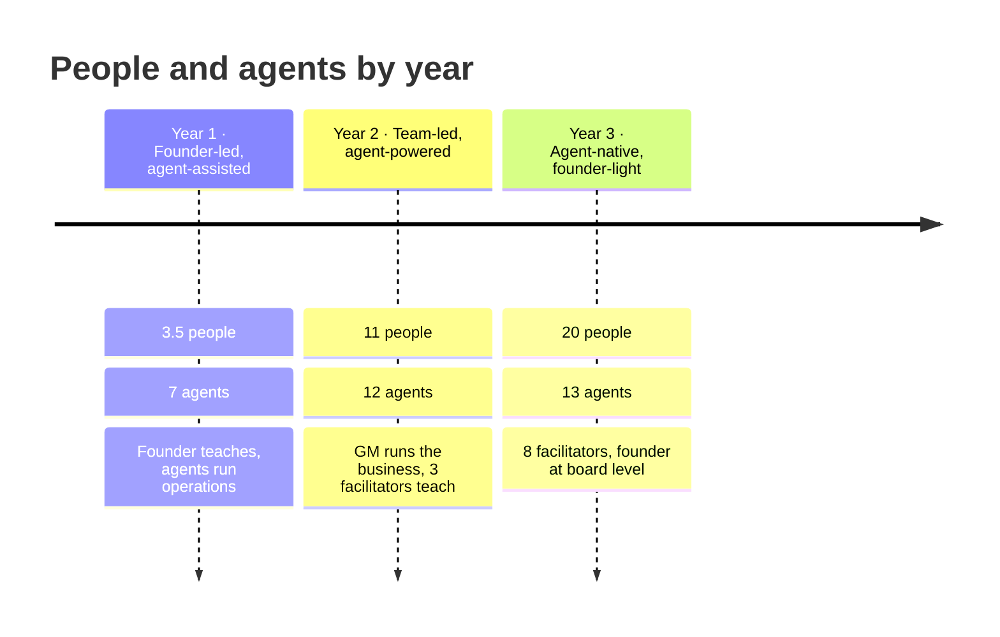

## Year 1 — Founder-led, agent-assisted

**Goal:** prove the ladder works while the founder keeps teaching, without drowning in admin.

| | |
|---|---|
| **People** | Founder · Head of AI Ops · Creative & content lead · Lead facilitator (0.5, from Q3) · freelancers |
| **Agents live** | CapabilityOS Coach · Scout · Concierge · Cohort Ops · Content Studio · Finance & Admin · Coach / TA (Q3) |
| **Human focus** | Founder teaches ~21 cohorts and the free monthly workshop, and records all video. Everyone else keeps him out of admin. |
| **Milestones** | 300 paying CapabilityOS subscribers · 600 Guild members · 250 graduates · 4 B2B contracts · every agent has a spec and an owner |

<Steps>
  <Step title="Q1 — Stand up the core">Hire Head of AI Ops and creative lead. Launch Scout, Concierge, Cohort Ops and Content Studio at L1, then move to L2 once each hits its quality bar.</Step>
  <Step title="Q2 — Automate the back office">Launch Finance & Admin. Move reminders, scheduling and invoicing to L3.</Step>
  <Step title="Q3 — Protect the founder's teaching time">Lead facilitator starts shadowing. Launch Coach / TA to cut prep and between-session support.</Step>
  <Step title="Q4 — Review and plan">Measure time saved per agent. Write the Year-2 hiring plan and start the GM search.</Step>
</Steps>

## Year 2 — Team-led, agent-powered

**Goal:** the business runs without the founder in the room every day.

| | |
|---|---|
| **People** | + GM · B2B & partnerships lead · CapabilityOS product lead · AI automation engineer · community lead · facilitators to 3 |
| **Agents added** | Proof · Community Pulse · Deal Desk · Curriculum Watch · Studios Production |
| **Human focus** | Facilitators deliver most cohorts. B2B lead owns enterprise. Founder teaches flagship sessions and the Executive Intensive. |
| **Milestones** | 1,800 Guild members · 15 B2B contracts · founder-touch revenue at 45% · automation engineer owns an eval suite for every agent |

## Year 3 — Agent-native, founder-light

**Goal:** a business a buyer could run: documented, staffed, and less dependent on the founder.

| | |
|---|---|
| **People** | + facilitators to 8 · B2B account exec · community associate · content producer · Studios lead |
| **Agents added** | Partner Radar; every existing agent upgraded after a year of evaluation data |
| **Human focus** | GM runs operations. Founder sits at board level, teaches flagship sessions and holds key relationships. |
| **Milestones** | 3,800 Guild members · 30 contracts with renewals · founder-touch revenue under 30% · agent specs, evals and SOPs ready for due diligence |

## KPIs for the humans + agents model

| KPI | Y1 target | Y2 target | Y3 target |
|---|---|---|---|
| Revenue per human FTE | $550k+ | $650k+ | $850k+ |
| CapabilityOS paying subscribers | 300 | 1,350 | 3,675 |
| Routine tasks handled by agents | 50% | 70% | 80% |
| First response to a learner (any hour) | under 5 min | under 5 min | under 5 min |
| Escalations answered by a person | 1 business day | same day | same day |
| Cohort completion | 70%+ | 70%+ | 70%+ |
| Learner satisfaction with support | 4.5/5 | 4.5/5 | 4.6/5 |
| Agent spend as share of people + agents cost | under 10% | under 10% | under 10% |
