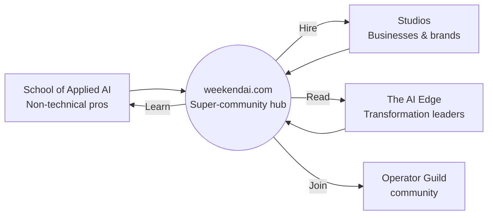

Each brand reaches a different part of the market. Every lead, student and reader ends up in the same place: **the WeekendAI super-community**. Traffic, trust and recurring revenue grow together instead of in separate silos.

<CardGroup cols={2}>
  <Card title="01 · School of Applied AI" icon="graduation-cap" href="/brands/school-of-applied-ai">
    **Education** · schoolofappliedai.com. Upskills non-technical professionals with a strict problem-solving curriculum. Includes [CapabilityOS](/brands/capabilityos), daily AI microlearning at capos.live.
  </Card>
  <Card title="02 · Studios by WeekendAI" icon="clapperboard" href="/brands/studios">
    **Agency** · studios.weekendai.com. Lead-gen websites, marketing automation, AI ads and short-form video for brands.
  </Card>
  <Card title="03 · WeekendAI Hub" icon="house-signal" href="/brands/weekendai-hub">
    **Platform** · weekendai.com. The main website that ties everything together. The audience lands here and gets routed.
  </Card>
  <Card title="04 · The AI Edge" icon="book-open" href="/brands/the-ai-edge">
    **Publishing** · theailedge.com. Playbooks, frameworks and community for AI transformation leaders.
  </Card>
</CardGroup>

## Audience flow

## Cross-brand hand-offs (operating rules)

| From | To | Trigger | Owner |
|---|---|---|---|
| School graduate | Studios | Graduate's company needs something built | Programme manager |
| Studios client | School | Client team needs upskilling to run what was built | Studios lead |
| AI Edge reader | School / B2B | Leader asks about training their team | B2B sales |
| Any lead | Guild | Every free resource download | Community manager |
