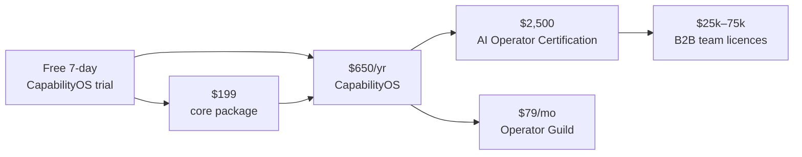

**Site:** [capos.live](https://capos.live) · **Part of:** School of Applied AI · **Role:** the daily-habit, recurring-revenue engine · **Share of Year-3 revenue:** ~15% (model)

CapabilityOS is a lifelong AI learning platform for busy professionals. Lessons arrive on channels people already use (Telegram, chat and email) and take 5–10 minutes a day. An AI coach adapts to each learner's role and projects. The promise on the site: *"Learn AI in 10 minutes a day. Ship real agents. On your phone."*

## A day with CapabilityOS

<Steps>
  <Step title="Daily lesson">5–10 minutes on one AI concept, tied to work the learner already does.</Step>
  <Step title="Applied exercise">Run a prompt, wire an agent or automate a task.</Step>
  <Step title="Project & portfolio">Every few weeks, ship something real and add it to a portfolio.</Step>
</Steps>

## The first year, mapped

| Period | Focus |
|---|---|
| Month 1 | Foundations of generative AI: how models think, prompting |
| Month 2 | AI at work every day: research, writing, analysis, inbox |
| Month 3 | Workflows and integrations: chaining models, using your own data, connecting tools |
| Month 4 | Building AI agents that do end-to-end work |
| Months 5–6 | 8 weeks of project work with coaching, ending in a portfolio |
| Months 7–12 | Continuous upgrade: new lessons, models and agents as the field moves |

Features include streaks, quizzes, certificates, a leaderboard, community and live Q&A.

## Pricing (from capos.live)

| Plan | Price | What's included |
|---|---|---|
| **Taster** | Free, 7 days | 7 daily lessons, full chat experience, quizzes and streaks |
| **Core lessons + exercises** | $199 one-time | 4 months of core lessons, daily exercises, AI-graded submissions, lifetime access; no community or coaching |
| **The full transformation** | $54/month, billed $650/year | Everything above plus 8 weeks of projects, certificates, leaderboards, community and continuous upgrades |
| **Year 2 onwards** | 50% off (~$325/year) | Continuous projects, skill upgrades and community |

*For context, the site compares this with 5–8 week executive AI programmes at $1,500–$3,500.*

## Why it matters to the plan

<CardGroup cols={3}>
  <Card title="Recurring revenue" icon="arrows-rotate">
    Annual subscriptions lift recurring + contracted revenue from about 45% to **about 51%** of Year-3 revenue. That closes more than half the gap to the 55% sale-readiness gate.
  </Card>
  <Card title="A daily habit" icon="fire">
    Daily contact through chat keeps the School in front of learners every day, not just during a cohort.
  </Card>
  <Card title="Low-cost acquisition" icon="filter">
    A free 7-day trial is a stronger lead magnet than a PDF, and it feeds the rest of the ladder.
  </Card>
</CardGroup>

## Model assumptions

| | Year 1 | Year 2 | Year 3 |
|---|---|---|---|
| New annual subscribers | 300 | 1,200 | 3,000 |
| Renewing subscribers (50% renewal, at 50% off) | – | 150 | 675 |
| Paying subscribers in year | 300 | 1,350 | 3,675 |
| Core packages sold ($199) | 200 | 800 | 2,000 |
| **CapabilityOS revenue** | **$235k** | **$988k** | **$2.57M** |

*Volumes, the 50% renewal rate and the 80% subscription gross margin are planning assumptions. Change them on the model's Assumptions sheet. Set "Include CapabilityOS" to 0 to see the investor-deck base case.*

## Where it sits on the ladder

<Warning>
**Overlap to resolve.** The $199 core package and the $497 AI Fluency Academy both sell self-paced foundations, and CapabilityOS's community overlaps with the Operator Guild. See the open decision in the [Decision log](/execution/decision-log). The recommended split: CapabilityOS for individuals building a daily habit, the Guild for practitioners and leaders, and CapabilityOS team seats bundled into B2B licences.
</Warning>

## How it runs (humans + agents)

| Work | Who |
|---|---|
| Daily lessons, quizzes, streak nudges, exercise grading | CapabilityOS Coach agent |
| Curriculum updates as models and tools change | Curriculum Watch agent drafts; product lead approves |
| Monthly live Q&A, project showcases, community moments | CapabilityOS product lead and facilitators |
| Subscriber support, refunds, renewal saves | Concierge agent; a person handles refunds and saves |

## KPIs

| KPI | Target |
|---|---|
| Trial → paid conversion | 10%+ |
| Day-30 active rate (paid) | 60%+ |
| Annual renewal rate | 50%+ (model), stretch 65% |
| Subscriber → Certification or Guild upgrade within 12 months | 10%+ |
| Share of new B2B deals that include CapabilityOS seats | 30%+ by Year 3 |
