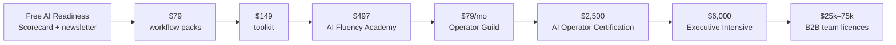

## Rungs, purpose and volume (model)

| Rung | Price | Purpose | Y1 | Y2 | Y3 |
|---|---|---|---|---|---|
| AI Readiness Scorecard + newsletter | Free | Capture email; show readiness gaps | n/a | n/a | n/a |
| Workflow packs / toolkit | $79 / $149 (~$110 blended) | First purchase; low-risk proof of value | 1,200 | 4,500 | 9,000 |
| AI Fluency Academy (evergreen, certified) | $497 | Scalable, zero-delivery-cost core course | 500 | 2,000 | 5,000 |
| Operator Guild membership | $79/month | Recurring home for every graduate | 600 | 1,800 | 3,800 members (year-end) |
| AI Operator Certification (6 weeks) | $2,500 | High-completion, outcome-proven cohort | 250 | 600 | 983 seats |
| Executive AI Leadership Intensive | $6,000 | Senior buyers; path into B2B | 15 | 60 | 175 seats |
| B2B team licences & enterprise | $25k–75k | Transferable, renewable contracts | 4 | 15 | 30 contracts |

*Benchmark: cohort instructors on Maven average about $20k per cohort, and Maven has paid $14M to instructors across ~15,000 students ([Maven](https://maven.com/maven/course-accelerator)).*

## Pricing rules

<Steps>
  <Step title="Every rung credits the next">Offer upgrade credit (for example, the Academy fee counts toward Certification) so moving up feels low-risk.</Step>
  <Step title="Annual Guild billing by default">Offer annual billing at a discount. Annual billing cuts churn and pulls cash forward.</Step>
  <Step title="Cohorts don't get discounts">Cohort price holds. Scarcity comes from the 12-seat cap.</Step>
  <Step title="Enterprise is priced on outcomes">B2B pricing is tied to seats plus Transformation Wall evidence, not hours.</Step>
</Steps>

<Warning>Year-3 average B2B contract value in the model is **$80k**, just above the $25k–75k band. It assumes multi-year deals and expansion. If ACV stays at $60k, Year-3 revenue drops by about $0.6M.</Warning>
