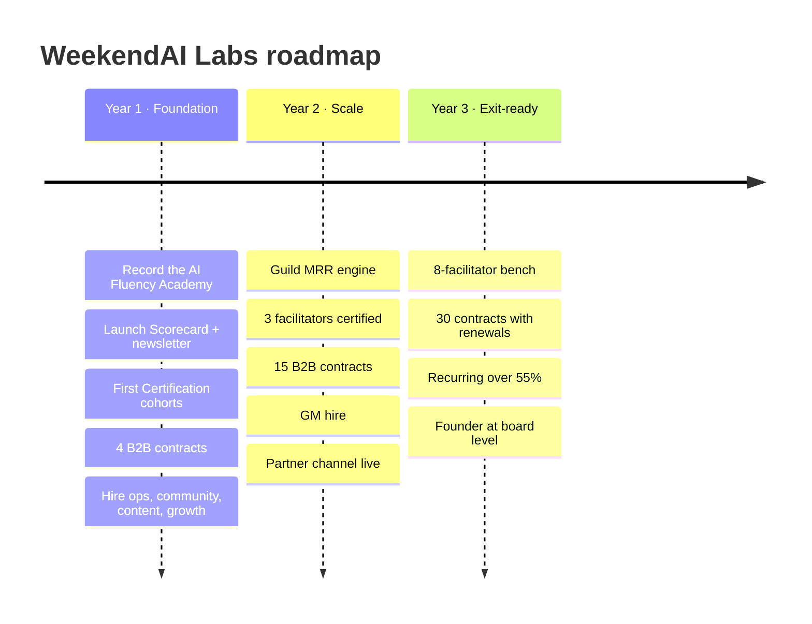

## Year 1: Foundation

| Quarter | Milestones |
|---|---|
| Q1 | Scorecard + newsletter live on weekendai.com · CRM with founder-touch tagging · Operator Guild launched · first 2 cohorts |
| Q2 | AI Fluency Academy recorded and launched ($497) · Transformation Wall live · first corporate workshop |
| Q3 | Executive Intensive pilot ($6,000) · first 2 B2B contracts · contract facilitators start shadowing |
| Q4 | 600 Guild members · 250 graduates · 4 B2B contracts · Year-2 plan and GM search |

## Year 2: Scale

- Annual Guild billing as the default; Academy + Guild bundle live
- 3 facilitators certified and licensed; founder delivers only flagship sessions
- GM hired; B2B team grows to 2
- Education, tech, service and media partner programmes formalised
- Exit: 1,800 Guild members · 15 contracts · founder-touch revenue at 45%

## Year 3: Exit-ready

- 8-facilitator bench; 80+ cohorts a year
- 30 B2B contracts, with multi-year renewals
- Recurring + contracted revenue above 55%; NRR above 110%
- IP, SOPs and facilitator licensing documented, ready for a data room
- Founder moves to board level
