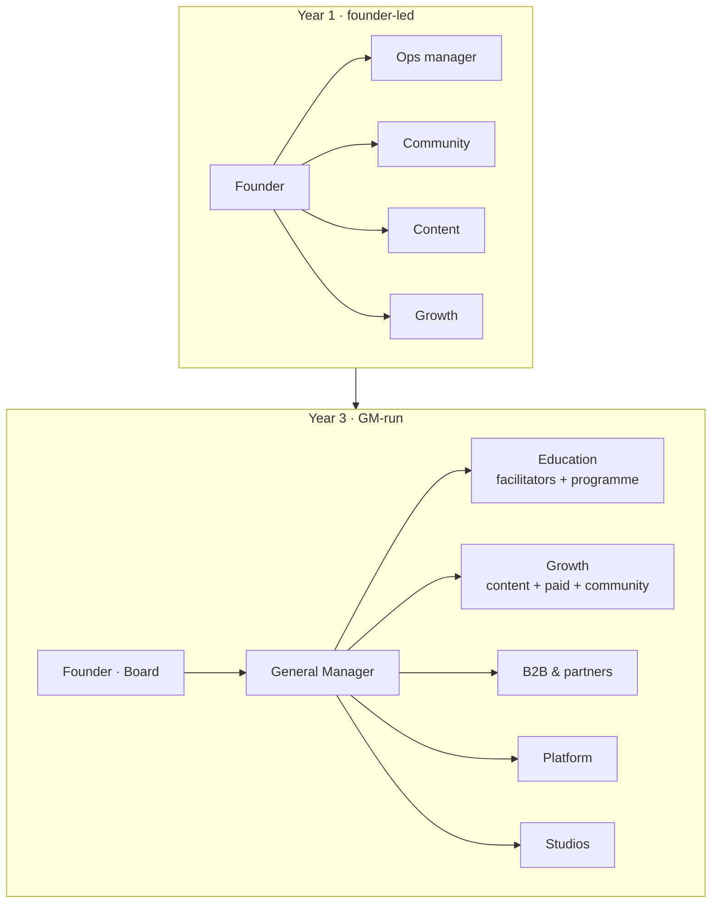

<Warning>
**The team is the weakest link in the current plan.** The briefs name no co-founders or operators yet. Naming even two operators (a lead facilitator and a growth lead) changes how buyers and investors read founder-dependency risk. Filling these roles is the first priority in the [first 90 days](/execution/first-90-days).
</Warning>

## Headcount plan (model)

| Role | Y1 | Y2 | Y3 | Loaded cost | Accountable for |
|---|---|---|---|---|---|
| Founder / CEO | 1 | 1 | 1 | $150k | Vision, flagship teaching, B2B relationships; moves to board level by Y3 |
| General Manager / COO | – | 1 | 1 | $165k | Runs operations, P&L, hiring |
| Programme & operations manager | 1 | 2 | 3 | $70k | Cohort scheduling, SOPs, Transformation Wall |
| Community manager | 1 | 2 | 3 | $60k | Guild engagement, events, retention |
| Content & video producer | 1 | 2 | 4 | $60k | YouTube, LinkedIn, lead magnets |
| Growth / marketing lead | 1 | 1 | 2 | $90k | Paid acquisition, funnel, CAC |
| B2B sales & partnerships | – | 2 | 4 | $90k | Enterprise pipeline, partner channel |
| Certified facilitators (bench) | – | 3 | 8 | $80k | Cohort and workshop delivery |
| Platform & automation engineer | – | 1 | 2 | $100k | Hub, CRM, community platform, the Wall |
| **Total FTE** | **5** | **15** | **28** | | |

*Loaded costs are planning assumptions. Change them on the model's Assumptions sheet.*

## Org evolution

## Founder-touch revenue

Founder-touch revenue is any revenue where the founder personally delivers, sells or is the named draw. Target: **70% → 45% → under 30%**. Tag every deal and cohort in the CRM so this can be measured each month.
